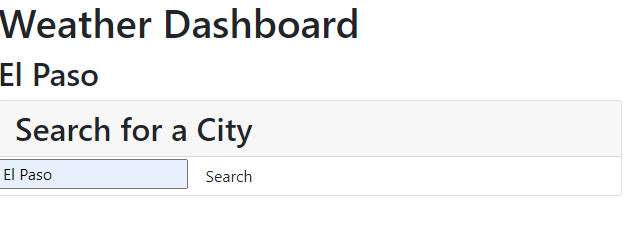
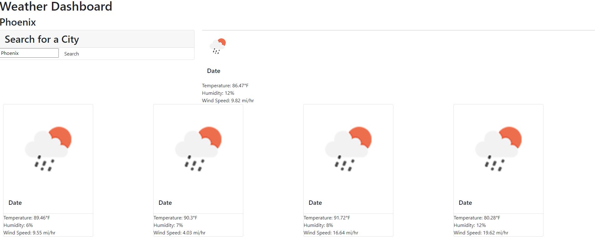

# 06-Weather-Dashboard

## Description
This project was created to provide weather data for a specific city. I was also able to further work on my JavaScript skills through this project.

Through this project I was able to learn how to fetch data from an API and display specific data points to my webpage.

## Usage

-To use this webpage, click on the link provided. You can also copy paste the link to use on your desired browser.

URL:https://volcomix13.github.io/06-Weather-Dashboard/

## Credits
-Tutor Armando Osorio for help with fetch function and loop.

  